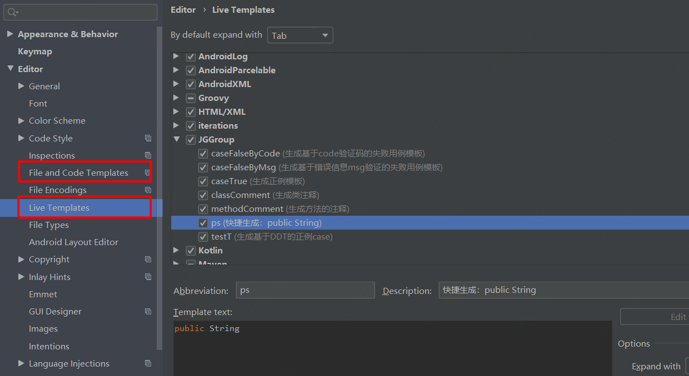

# 项目说明
**项目名称：**  
基于SpringBoot的金刚模板化接口自动化测试项目

**说明：**  
- 用到的模板要根据具体的项目进行定制
- 这个项目有些模块代码写的比较粗糙一些，后续逐步优化调整
- 有问题可邮箱联系沟通，邮箱：jinganglong123@126.com

# 测试分工

**说明：**
- 下面是一个样例，提前约定好各个模块的包名，方便团队成员协同维护用例
- 所有模块的用例集维护在com.jingang.springinterfacetest.cases下面


| 模块中文名            | 模块对应的包名     | 脚本维护负责人 | 备注 |
| --------------------- | ------------------ | -------------- | ---- |
|  控制台--首页          |       homePage          |                |      |
|  控制台--全部产品      |       allProduct         |                |      |
|  控制台--我的应用      |       myApp              |                |      |
|                      |                     |                |      |
|                      |                     |                |      |
|                      |                     |                |      |


# 自动化框架使用说明

## 1 模块说明

主要模块：用例维护、配置管理、公共方法、数据管理、报告模块、告警通知

模块 | 支持的功能 | 备注
---|---|---
用例维护|静态数据用例、动态数据用例|动态数据用例基于DataProvider实现
配置管理|手工加载配置、springBoot自动加载配置|静态基于Excel实现
通用模块|维护与业务相关的公共模块或数据准备方法
测试工具类|http请求类、DB资源加载、JsonSchemaByFge、常用数据加工方法、DNS配置等待处理方法|
数据管理|基于properties的数据管理、基于Excel的数据管理、基于Yaml的数据管理等|
告警通知|Email通知、企业微信群机器人通知|

## 2 代码结构
```
├── jg-api-autotest XX接口自动化测试项目
│   ├── src/main/java/com.jingang.springinterfacetest
│   │   ├── cases（维护测试用例）
│   │   │   ├── demoCaseModule（用例demo）
│   │   │   ├── TestNGSpringBootCaseConfig.java（测试用例父类）
│   │   │   ├── XXX（各个用例模块）
│   │   ├── common（通用模块，一般维护与具体业务相关的一些公共模块类、通用的一些方法）
│   │   │   ├── GetTestData.java（获取测试数据通用类）
│   │   │   ├── SendNotification.java（发送通知的公共类）
│   │   ├── config（测试配置类）
│   │   │   ├── ExtentTestNGIReporterListener.java（生成测试报告的监听类）
│   │   │   ├── JGTestNgListener.java（自定义的testNg的监听类，实现某些后续操作）
│   │   │   ├── TestConfig.java（笨方式，用于ResourceBundle读取属性配置，设置静态的配置实体类，不建议使用）
│   │   │   ├── TestDataConfig.java（测试数据配置的实体类，自动从properties中读取data前缀的预制数据）
│   │   │   ├── UrlConfig.java（接口路径类配置实体类，自动从properties中读取url前缀的接口路径）
│   │   ├── control（维护对外提供调用功能的api接口）
│   │   ├── model（维护一些参数对象模型）
│   │   ├── untils（维护工具类）
│   │   │   ├── XXX……（各类测试常用工具类）
│   ├── src/main/resources
│   │   ├── excelFiles（存放Excel数据文件）
│   │   ├── jsonSchema（存放jsonSchema）
│   │   ├── mapper（存放sqlMapper文件）
│   │   ├── static（存放一些静态资源）
│   │   ├── templates（存放一些模板）
│   │   ├── application.properties（属性配置文件）
│   │   ├── application-prod.properties（用于生产环境的属性配置文件）
│   │   ├── application-test.properties（用于测试环境的属性配置文件）
│   │   ├── databaseConfig.xml（数据库连接配置）
│   │   ├── log4j2.xml（日志配置）
│   │   ├── testng.xml（TestNG执行配置）
│   ├── test-output（存储测试产出，如：报告、覆盖率文件）

```
## 3 初始配置说明
### 3.1 设置Live Templates
建立Template Group，例如起名：JGGroup



#### 1）生成基于code验证码的失败用例通用模块模板

新建Live Template，设置Abbreviation:caseFalseByCode，设置Description:生成基于code验证码的失败用例通用模块模板

```
public boolean caseFalseCode(,Integer errCode){
    Map<String, String> headers=new HashMap<String, String>();
    headers.putAll(getTestData.getLoginCookies());
//  headers.put("Accept", "application/json, text/plain, */*");
    // get方式
    Map<String, String> param=new HashMap<String, String>();
    param.put("",);
    httpresult=JGHttp.doGet(urlConfig. + urlConfig.,param,headers);
    // post方式
//    String param = String.format("", );
//    httpresult = JGHttp.doPostJson(urlConfig. + urlConfig., param, headers);

    // 通过响应码校验结果
    if(httpresult.getResponseCode() != 200){
        return false;
    }
    // 通过响应体中的code码来判断结果
    if(JSONObject.parseObject(httpresult.getResponseBody()).getInteger("code") != errCode){
        return false;
    }
    return true;
}
```

#### 2）生成基于错误信息msg验证的失败用例通用模块模板

新建Live Template，设置caseFalseModuleByMsg，设置Description:生成基于错误信息msg验证的失败用例通用模块模板

```   java
public boolean caseFalseMsg(,String msgerr) {
    Map<String, String> headers = new HashMap<String, String>();
    headers.putAll(getTestData.getLoginCookies());
//    headers.put("Accept", "application/json, text/plain, */*");
    // get方式
    Map<String, String> param = new HashMap<String, String>();
    param.put("", );
    httpresult = JGHttp.doGet(urlConfig.apiDesignerUrl + urlConfig., param, headers);

    // post方式
//    String param = String.format("", );
//    httpresult = JGHttp.doPostJson(urlConfig.apiDesignerUrl +, param, headers);

    // 通过响应码校验结果
    if (httpresult.getResponseCode() != 200) {
        return false;
    }
    // 通过响应体中的message是否出现预期错误信息来判断结果
    if (!JSONObject.parseObject(httpresult.getResponseBody()).getString("message").equals(msgerr)) {
        return false;
    }
    // 模糊匹配关键字来判断结果
//    if(!JGString.matchString(".*" + msgerr + ".*",httpresult.getResponseBody())){
//        return false;
//    }
    return true;
}
```
#### 3）生成正例通用模块模板

新建Live Template，设置Abbreviation:caseTrueModule，设置Description:生成正例通用模块模板
    public JGHttpResult httpresult;

```java
// 存储请求接口返回的响应头和消息体
public JGHttpResult httpresult;

public boolean caseTrue(,){
    
    Map<String, String> headers=new HashMap<String, String>();
    // 设置cookie
    headers.putAll(getTestData.getLoginCookies());
//    headers.put("Accept", "application/json, text/plain, */*");
//    get方式
    Map<String, String> param=new HashMap<String, String>();
    param.put("",);
    httpresult=JGHttp.doGet(urlConfig.apiDesignerUrl+urlConfig.,param,headers);

    // post方式
//    String param = String.format("", );
//    httpresult = JGHttp.doPostJson(urlConfig.apiDesignerUrl +, param, headers);

    // 通过响应码校验结果
    if(httpresult.getResponseCode()!=200){
    return false;
    }
    // 通过响应体中的code码来判断结果
    if(JSONObject.parseObject(httpresult.getResponseBody()).getInteger("code")!=20000000){
    return false;
    }
    // 通过响应体中的message来判断结果
    if(!JSONObject.parseObject(httpresult.getResponseBody()).getString("message").equals("成功")){
    return false;
    }
    // 模糊匹配关键字来判断结果
//    if(!JGString.matchString("",httpresult.getResponseBody())){
//        return false;
//    }

        // 通过JsonSchema校验接口数据返回格式
//    if (!JGJsonSchemaByFge.AssertJsonSchemaByJsonStringAndJsonFile(httpresult.getResponseBody(),"src/main/resources/jsonSchema/.json"))
//    {
//        return false;
//    }
    return true;
}
```


#### 4）生成基于DDT的Case模板

新建Live Template，设置Abbreviation:testCase，设置Description:生成基于DDT的Case模板

```java
@DataProvider
public Object[][] dataT$num$(){
    int row = 1;
    int col = 1;
    Object[][] objects = new Object[row][col];
    // 数据处理如下
    objects[0][0] = "正例：";
    objects[0][1] = ;
    objects[0][2] = ;
    objects[0][3] = ;
    objects[0][4] = ;
    objects[0][5] = ;
    objects[0][6] = ;
    objects[0][7] = ;
//    for (int i = 0;i < row;i++){
//
//    }
    return objects;
}
@Test(dataProvider = "dataT$num$",priority = $num$,groups = {"default"})
public void testT$num$(String title,,) {
    // 打印用例标题
    log.info(title);
    // 中间处理
    // 断言
    Assert.assertTrue(caseTrue(,));
}
```

#### 5）生成类注释

新建Live Template，设置Abbreviation:classComment，设置Description:生成类注释

```
**
* @description: $description$
* @author: $user$
* @date: $date$-$time$
**/
```

#### 6）生成方法的注释

新建Live Template，设置Abbreviation:methodComment，设置Description:生成方法的注释

```
**
* @description: $description$
* @param: $params$
* @return: $returns$
* @author: $user$
* @date: $date$-$time$
**/
```


### 3.2 创建File and Code Templates

#### 1）创建普通用例专用的Class模板

设置Name:JG-CaseClass，Extension:java

```java
#if (${PACKAGE_NAME} && ${PACKAGE_NAME} != "")package ${PACKAGE_NAME};#end
#parse("File Header.java")
import com.alibaba.fastjson.JSONObject;
import com.jingang.springinterfacetest.cases.TestNGSpringBootCaseConfig;
import com.jingang.springinterfacetest.utils.JGHttp;
import com.jingang.springinterfacetest.utils.JGHttpResult;
import lombok.Data;
import lombok.extern.slf4j.Slf4j;
import org.springframework.beans.factory.annotation.Autowired;
import org.springframework.stereotype.Component;
import org.testng.Assert;
import org.testng.annotations.AfterClass;
import org.testng.annotations.BeforeClass;
import org.testng.annotations.DataProvider;
import org.testng.annotations.Test;
import java.util.HashMap;
import java.util.Map;
/**
 * @program: ${PROJECT_NAME}
 * @description: ${description}
 * @author: ${USER}
 * @create: ${YEAR}-${MONTH}-${DAY} ${HOUR}:${MINUTE}
 **/
@Slf4j
@Component
@Data
public class ${NAME} extends TestNGSpringBootCaseConfig {
   public JGHttpResult httpresult;

    public boolean caseTrue(String cookie,) {
        Map<String, String> headers = new HashMap<String, String>();
//      headers.putAll(getTestData.getLoginCookies());
//      headers.put("Accept", "application/json, text/plain, */*");
        // 南京控制台需要使用的header
        headers.put("Accept", "application/json, text/plain, */*");
        headers.put("X-Requested-With", "XMLHttpRequest");
        headers.put("Content-Type", "application/json;charset=UTF-8");
        headers.put("Cookie", cookie);
        headers.put("User-Agent", testDataConfig.userAgent);
        // get方式
        Map<String, String> param = new HashMap<String, String>();
        param.put("", );
        httpresult = JGHttp.doGet(urlConfig. + urlConfig., param, headers);

        // post方式
//        String param = String.format("", );
//        httpresult = JGHttp.doPostJson(urlConfig. + urlConfig. , param, headers);

        // 【断言方式】通过响应码校验结果
        if (httpresult.getResponseCode() != 200) {
            return false;
        }
        // 【断言方式】通过响应体中的code码来判断结果
        if (JSONObject.parseObject(httpresult.getResponseBody()).getInteger("code") != 20000000) {
            return false;
        }
        // 通过响应体中的code码来判断结果--南京控制台
        if (JSONObject.parseObject(httpresult.getResponseBody()).getInteger("resultCode") != 0) {
            return false;
        }
        // 通过响应体中的message来判断结果--南京控制台
        //        if (!JSONObject.parseObject(httpresult.getResponseBody()).getString("resultMsg").equals("成功")) {
        //            return false;
        //        }
        // 【断言方式】通过响应体中的message来判断结果
        if (!JSONObject.parseObject(httpresult.getResponseBody()).getString("message").equals("成功")) {
            return false;
        }
        // 【断言方式】模糊正则匹配关键字来判断结果
//        if(!JGString.matchString("",httpresult.getResponseBody())){
//            return false;
//        }

        // 【断言方式】通过JsonSchema校验接口响应报文格式
//        if (!JGJsonSchemaByFge.AssertJsonSchemaByJsonStringAndJsonFile(httpresult.getResponseBody(),"src/main/resources/jsonSchema/.json"))
//        {
//            return false;
//        }
        // 【断言方式】通过查询数据库匹配核对检查数据
        
        // 【断言方式】通过相关接口辅助验证
        
        return true;
      }

    /**
     * 前置步骤：维护本类下所有用例执行前需要准备的前置条件
     **/
    @BeforeClass
    public void beforeClass(){
        log.info("提示：在该类（${PACKAGE_NAME}.${NAME}）下所有用例执行前前执行");
        // 前置条件准备

    }
    
    /**
     * 用例维护步骤：基于DDT思路，维护该接口的用例case
     **/     
    /**
     * 【测试场景P1】：基础检查（随机一组正确入参，检查接口连通性、是否返回预期关键字段）
     **/ 
    @DataProvider
    public Object[][] dataT1(){
        int row = 1;
        int col = 3;
        Object[][] objects = new Object[row][col];
        // 数据处理如下
        objects[0][0] = "正例：${description}基础检查";
        objects[0][1] = ;
        objects[0][2] = ;
        return objects;
    }
    @Test(dataProvider = "dataT1",priority = 1,groups = {"default"})
    public void testT(String title,,) {
        // 打印用例标题
        log.info(title);
        // 中间处理
        // 断言
        Assert.assertTrue(caseTrue(,));
    }
    
    /**
     * 【测试场景P2】：正常多角度（各种业务角度正常场景的参数组合）
     **/ 
    
    
    /**
     * 【测试场景P3】：异常多角度（各种业务角度异常场景的参数组合）
     **/ 
    
    /**
     * 【测试场景P4】：必输项检查（入参必输项场景组合检查）
     **/ 
    
    /**
     * 【测试场景P5】：边界值检查（入参进行特殊字符、字符串长度边界、数字大小边界等场景检查）
     **/

    
    /**
     * 后置步骤：维护本类下所有用例执行后需要进行的后置处理
     **/
    @AfterClass
    public void afterClass(){
        log.info("提示：在该类（${PACKAGE_NAME}.${NAME}）下所有用例执行完毕后执行");
        // 后置处理

    }    
    
    
}


```
#### 2）创建业务流用例专用的Class模板

设置Name:JG-BusinessFlowCaseClass，Extension:java

```java
#if (${PACKAGE_NAME} && ${PACKAGE_NAME} != "")package ${PACKAGE_NAME};#end
#parse("File Header.java")
import com.jingang.springinterfacetest.cases.TestNGSpringBootCaseConfig;
import lombok.Data;
import lombok.extern.slf4j.Slf4j;
import org.springframework.beans.factory.annotation.Autowired;
import org.springframework.stereotype.Component;
import org.testng.Assert;
import org.testng.annotations.AfterClass;
import org.testng.annotations.BeforeClass;
import org.testng.annotations.DataProvider;
import org.testng.annotations.Test;

/**
 * @program: ${PROJECT_NAME}
 * @description: ${PACKAGE_NAME}模块下的业务流用例
 * @author: ${USER}
 * @create: ${YEAR}-${MONTH}-${DAY} ${HOUR}:${MINUTE}
 **/
@Slf4j
@Data
public class ABusinessFlow extends TestNGSpringBootCaseConfig {
    /** 业务流用例的指导原则：
     *  1）测试单独某个接口的场景，前置依赖较多的相关接口，可将多个接口串成业务流用例
     *  2）接口所测业务场景的业务流属性较强，适合多个接口串在一起测试
     *  3）原则上业务流用例不要跨模块，需要依赖其他模块接口的，通过维护前置条件方法来准备
     *  4）其他情况不太适合一个一个接口独立测试的case，可维护成业务流用例
     *
     **/
    /**
     * 步骤1：统一维护自动装配用到的接口对象
     **/

//    eg: 业务用例需要使用ApiList接口
//    @Autowired
//    public ApiList apiList;

    /**
     * 步骤2：维护本类下所有业务流用例执行前需要准备的前置条件
     **/
//    @BeforeClass
//    public void beforeClass() {
//        log.info("提示：在该类（${PACKAGE_NAME}）下所有用例执行前前执行");
//        // 前置条件准备
//
//    }

    /**
     * 步骤3：准备某业务流用例需要的测试数据
     **/
//    @DataProvider
//    public Object[][] dataT1() {
//        int row = 1;
//        int col = 1;
//        Object[][] objects = new Object[row][col];
//        // 数据处理如下
//        objects[0][0] = "正例：";
//        objects[0][1] =;
//        objects[0][2] =;
//        objects[0][3] =;
//        objects[0][4] =;
//        objects[0][5] =;
//        objects[0][6] =;
//        objects[0][7] =;
//        //    for (int i = 0;i < row;i++){
//        //
//        //    }
//        return objects;
//    }

    /**
     * 步骤4：维护业务流用例case模块
     **/
//    @Test(dataProvider = "dataT1", priority = 1, groups = {"default"})
//    public void testT1(String title,,) {
//        // 打印用例标题
//        log.info(title);
//        // 业务流处理
//
//
//        // 断言
//        Assert.assertTrue();
//    }

    /**
     * 步骤5：维护本类下所有业务流用例执行后需要进行的后置处理
     **/
//    @AfterClass
//    public void afterClass() {
//        log.info("提示：在该类（${PACKAGE_NAME}）下所有用例执行完毕后执行");
//        // 后置处理
//
//    }

}


```


### 3.3 Idea插件

需要安装如下插件：  

1）GsonFormat  

快捷键：alt+s

替代方案：https://www.bejson.com/json2javapojo/new/

2）Lombok


## 4 脚本维护规范


### 4.1 接口命名规范

**例如针对如下被测接口：**

http://127.0.0.1:8089/projectMember/list?projectCode=875d506633884a9cb0446bdf3d0035a5&memberName=&start=0&length=10

#### 1）properties配置命名参考：

在properties中，变量名要从接口路径中摘取较唯一的名字来命名：

建议命名为：

url.projectMemberList

不建议命名为：url.list，因为容易重复不唯一，所以取路径的最后两节来组成变量名。

**命名规则：**路径最后1个或2个节点名拼接到一起构成属性名称（确保属性名称全局唯一）

#### 2）用例类名命名参考：

在cases包下，新建接口用例类名时，要保持和前面接口路径变量名一致。

​	建议命名为：ProjectMemberList.java（注意首字母大写）

**命名规则：**接口用例类的名称要和接口路径的属性名称一致，但首字母要大写

#### 3）接口入参JavaBean命名参考：

如果需要定义接口入参的JavaBean实体类

​	建议命名为：ProjectMemberListParam.java（后面加上Param）

**命名规则：**接口入参的JavaBean类名为对应的接口用例类名+Param组成

### 4.2 Git规范

1）建议每完成一个接口的用例，就push到远程代码仓库，要求每天下班前必须把当天编写的代码push到远程仓库。

2）每次Push前一定要先pull一下，更新一下本地代码，并确保工程可编译执行成功才可以上传（执行一个test方法确保可以编译执行成功即可）。

3）commit代码时，一定要写上准确的message，描述本次提交的内容


## 5 功能说明

### 5.1 功能汇总表

功能 | 功能介绍 | 演示demo  | 备注   
---|:---|:---|--- 
动态数据用例模板 | 该模板支持动态测试数据的用例维护 | com.jingang.springinterfacetest.cases.demoCaseModule.ActiveDataCase | 无
jsonSchema功能 | jsonSchema功能用于接口格式的详细验证 | com.jingang.springinterfacetest.cases.demoCaseModule.JsonSchemaDemo |
企业微信通知功能 | 通过监听testNG的执行，对失败的用例发送企业微信通知 | com.jingang.springinterfacetest.cases.demoCaseModule.NotificationCaseDemo |

### 5.2 功能详细说明

#### 企业微信通知功能


1. 通过对testNG添加监听器（com.jingang.springinterfacetest.config.JGTestNgListener），当用例执行失败时，触发企业微信通知。
2. 在properties中设置开关：notificationSwitch=on，当设为on时才会发送通知，否则并不发送。
3. 使用前需要设置类（com.jingang.springinterfacetest.utils.Notification）中常量webHookUrl，填写企业微信的webhook的url地址。
4. 该功能涉及的类如下：com.jingang.springinterfacetest.utils.Notification、com.jingang.springinterfacetest.utils.ConfigFile、com.jingang.springinterfacetest.config.TestConfig、com.jingang.springinterfacetest.config.JGTestNgListener、com.jingang.springinterfacetest.common.SendNotification

## 

## 6 参考代码

### 6.1 json字符串转java简单对象

```java
//json字符串转java简单对象
public static void jsonStrToJavaBean() {
String s ="{\"action\":\"add\",\"id\":\"1\",\"ordinal\":8,\"organUnitFullName\":\"testJSON\",\"parent\":\"0\",\"suborderNo\":\"58961\"}";
Data data = JSON.parseObject(s, Data.class);
System.out.println("data对象"+data.toString());
System.out.println("action="+data.getAction()+"---id="+data.getId());
//data对象Data{id='1', suborderNo='58961', organUnitType='null', action='add', parent='0', organUnitFullName='testJSON', ordinal=8}
//action=add---id=1

/**
* 另一种方式转对象
*/
Data dd = JSON.parseObject(s, new TypeReference<Data>() {});
System.out.println("另一种方式获取data对象"+dd.toString());
System.out.println("另一种方式获取="+dd.getAction()+"---id="+dd.getId());
//另一种方式获取data对象Data{id='1', suborderNo='58961', organUnitType='null', action='add', parent='0', organUnitFullName='testJSON', ordinal=8}
//另一种方式获取=add---id=1
}
```
